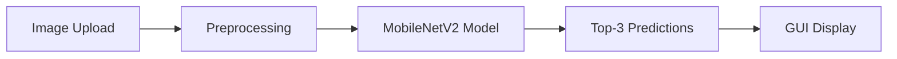

# MobileNetV2 Image Classifier 🖼️🤖

A user-friendly image classification tool powered by MobileNetV2 deep learning model with an intuitive Tkinter GUI interface.


## 🌟 Features

- **🚀 Fast & Lightweight**: Uses MobileNetV2 for efficient inference
- **🎯 High Accuracy**: Pre-trained on ImageNet dataset with 1,000 object categories
- **💻 User-Friendly GUI**: Simple Tkinter interface for easy image upload
- **📊 Confidence Scores**: Shows top 3 predictions with confidence percentages
- **🖼️ Image Preview**: Displays uploaded images with real-time predictions
- **⚡ Real-time Processing**: Instant classification results

## 🎯 What It Does

This application allows users to upload any image and get instant AI-powered predictions about what objects are in the image. Perfect for:

- Educational demonstrations of deep learning
- Quick object identification
- Mobile/embedded AI prototyping
- Computer vision learning projects

## 🛠️ Installation

### Prerequisites

- Python 3.7 or higher
- pip package manager

### Quick Setup

1. **Clone the repository**
   ```bash
   git clone https://github.com/yourusername/mobilenet-image-classifier.git
   cd mobilenet-image-classifier
   ```

2. **Install required packages**
   ```bash
   pip install -r requirements.txt
   ```

3. **Run the application**
   ```bash
   python main.py
   ```

### Required Dependencies

```txt
tensorflow>=2.8.0
Pillow>=8.3.0
numpy>=1.21.0
tkinter (usually comes with Python)
```

## 🚀 Usage

### Basic Usage

1. **Launch the application**
   ```bash
   python main.py
   ```

2. **Upload an image**
   - Click the "Upload Image" button
   - Select any image file (JPG, PNG, etc.)
   - The image will be displayed in the preview window

3. **View predictions**
   - Top 3 predictions appear instantly
   - Each prediction shows the category name and confidence percentage
   - Results are based on ImageNet's 1,000 object categories

### Example Output

```
📸 Uploaded Image: dog.jpg

🏆 Top Predictions:
1. Golden Retriever - 87.3%
2. Labrador Retriever - 9.2%  
3. Nova Scotia Duck Tolling Retriever - 2.1%
```

## 🏗️ How It Works

### Architecture Overview



### Technical Process

1. **Model Loading**: Pre-trained MobileNetV2 with ImageNet weights
2. **Image Preprocessing**: 
   - Resize to 224×224 pixels
   - Normalize pixel values
   - Convert to model input format
3. **Inference**: Process through MobileNetV2 CNN
4. **Post-processing**: Extract top 3 predictions with confidence scores
5. **Display**: Show results in user-friendly format

## 📁 Project Structure

```
mobilenet-image-classifier/
│
├── main.py                 # Main application file
├── requirements.txt        # Python dependencies
├── README.md              # This file
├── models/                # Model files (auto-downloaded)
├── sample_images/         # Example test images
└── screenshots/           # GUI screenshots
```

## 🖥️ System Requirements

- **Operating System**: Windows, macOS, or Linux
- **RAM**: Minimum 4GB (8GB recommended)
- **Storage**: 50MB for model weights
- **Python**: Version 3.7 or higher

## 🎨 GUI Interface

The application features a clean, intuitive interface with:

- **File Upload Button**: Easy image selection
- **Image Preview Panel**: Shows uploaded image
- **Predictions Panel**: Displays classification results
- **Confidence Bars**: Visual representation of prediction confidence

## 🔧 Customization

### Adding New Models

To use different pre-trained models:

```python
# In main.py, replace MobileNetV2 with:
model = tf.keras.applications.ResNet50(weights='imagenet')
# or
model = tf.keras.applications.VGG16(weights='imagenet')
```

### Adjusting Prediction Count

Change the number of top predictions:

```python
# Modify this line to show more/fewer predictions
top_predictions = predictions[0].argsort()[-5:][::-1]  # Top 5 instead of 3
```

## 🤝 Contributing

We welcome contributions! Here's how you can help:

1. **Fork** the repository
2. **Create** a feature branch (`git checkout -b feature/amazing-feature`)
3. **Commit** your changes (`git commit -m 'Add amazing feature'`)
4. **Push** to the branch (`git push origin feature/amazing-feature`)
5. **Open** a Pull Request

### Areas for Contribution

- Additional model support (ResNet, VGG, etc.)
- Batch processing capabilities
- Export results functionality
- Enhanced GUI design
- Performance optimizations

  
## 🔮 Future Enhancements

- [ ] Batch image processing
- [ ] Custom model training interface
- [ ] Mobile app version
- [ ] Web-based interface
- [ ] Real-time camera input
- [ ] Export results to CSV/JSON

---

⭐ **Star this repo** if you find it useful! It helps others discover the project.
